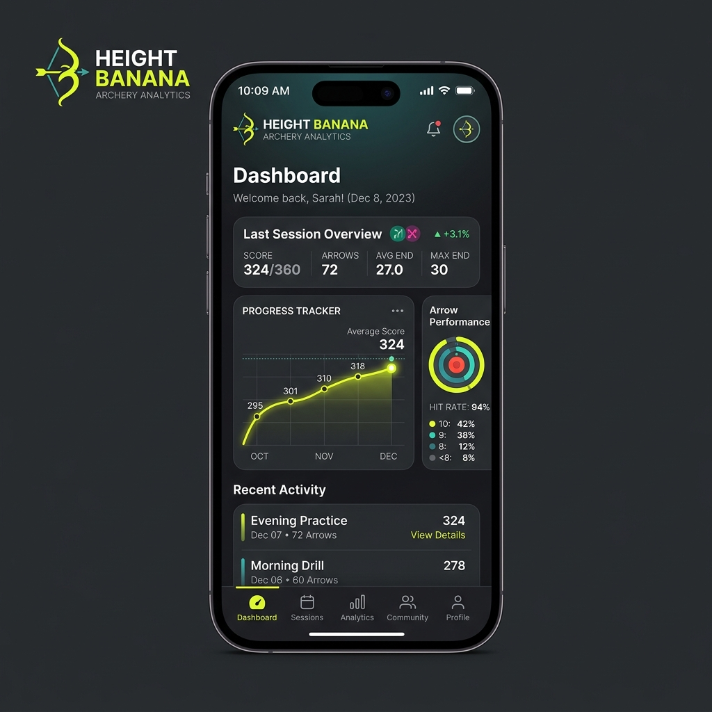
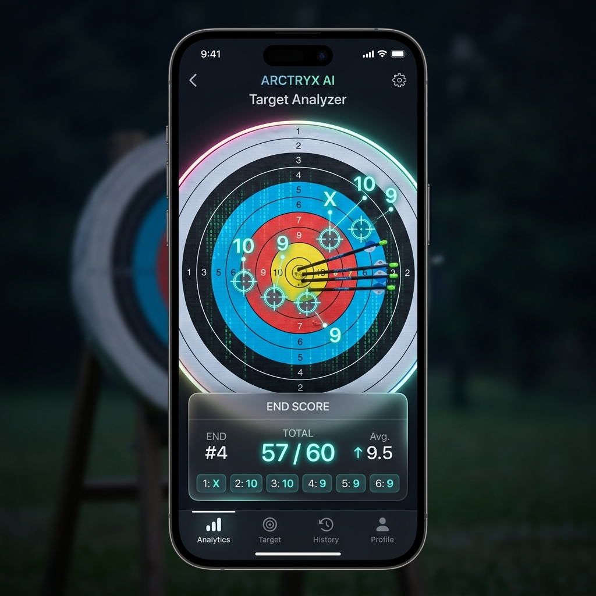

# Height Banana UI Mockups

Here are some conceptual designs for the **Height Banana** archery analytics app! These visualizations demonstrate the potential aesthetic and functionality based on a dark-mode, premium design system.

## 📊 Analytics Dashboard

This is a mockup of the main dashboard, where users can see an overview of their last archery session, track progress over time via dynamic line charts, and analyze their overall hit rates.

---

## 🎯 Computer Vision Target Analyzer

This conceptualizes the core Computer Vision feature! It shows an overlay identifying arrow impacts on a standard FITA target face, with floating neon numbers indicating the mapped score (10, 9, X, etc.) and a glassmorphism summary card at the bottom.

